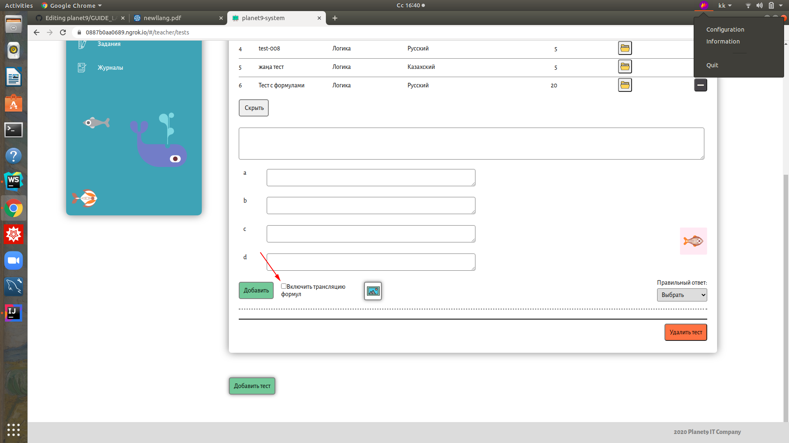
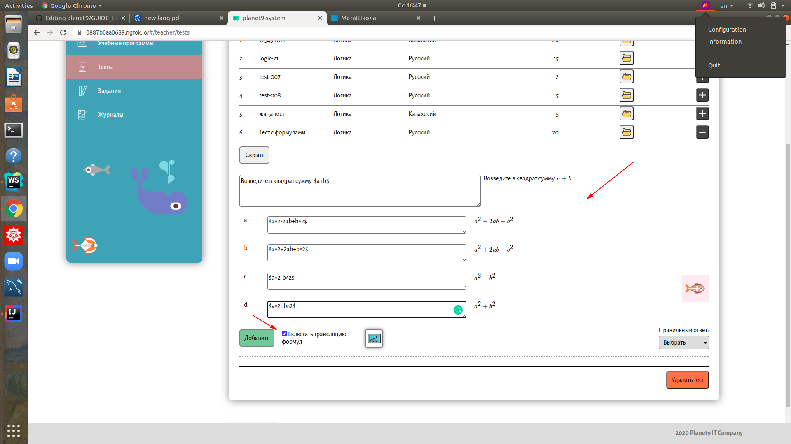

# planet9 - платформа для дошкольного и школьного образования :books:
***Инструкция по работе с формулами в latex***

*Условные обозначения:* :anchor: - обязательно к ознакомлению, :bookmark: - можно и пропустить, :telescope: - полезно знать, :chart_with_upwards_trend: - в тренде, :key: - ключевой момент, :art: - подойти творчески, :link: - полезная ссылка, :performing_arts: - другой взгляд, :mountain_cableway: - лучше узнать.

Перейти :point_right: [planet9](https://b53704e2e051.ngrok.io)

## О  [latex](https://ru.wikipedia.org/wiki/LaTeX) :anchor:

:heavy_plus_sign: высокое качество шрифта

:heavy_plus_sign: удобная система весртки формул

:heavy_plus_sign: поддержка кодировки utf-8

:heavy_plus_sign: используется во многих научных журналах

## Краткое руководство пользователя :key:

**Введение**
Для использования набора формул в платформе просто подключите *Трансляцию формул*

**1. Набор простейших формул**

  [1.1 Степени и индексы]()
  
  [1.2 Дроби]()
  
  [1.3 Скобки]()
  
  [1.4 Корни]()
   
  [1.5 Штрихи и многоточия]()
  
  [1.6 Функции]()
  
**2. Включные и выключные формулы** :telescope:

 [1.1 Операции, отношения]()
  
  [1.2 Символы из пакета amssymb]()
  
  [1.3 Включение текста в формулы]()
  
  [1.4  Скобки переменного размера]()
   
  [1.5 Набор матриц]()

#### 1.1 Степени и индексы

#### 1.2 Дроби

Перейти :point_right: [planet9](https://b53704e2e051.ngrok.io)

:link: http://tug.org/

:link: https://miktex.org/

Мы с партнером :heart: Latex
