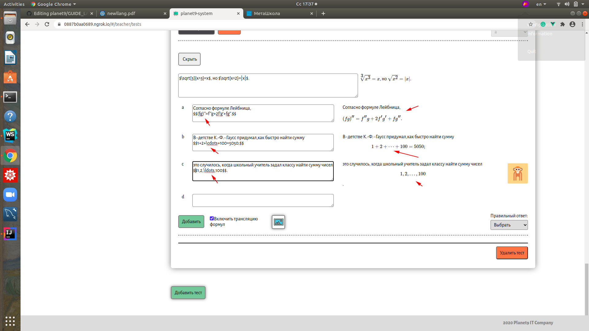

# planet9 - платформа для дошкольного и школьного образования :books:
***Инструкция по работе с формулами в latex***

*Условные обозначения:* :anchor: - обязательно к ознакомлению, :bookmark: - можно и пропустить, :telescope: - полезно знать, :chart_with_upwards_trend: - в тренде, :key: - ключевой момент, :art: - подойти творчески, :link: - полезная ссылка, :performing_arts: - другой взгляд, :mountain_cableway: - лучше узнать.

Перейти :point_right: [planet9](https://planet9.kz)

## О  [latex](https://ru.wikipedia.org/wiki/LaTeX) :anchor:

:heavy_plus_sign: высокое качество шрифта

:heavy_plus_sign: удобная система весртки формул

:heavy_plus_sign: поддержка кодировки utf-8

:heavy_plus_sign: используется во многих научных журналах

## Краткое руководство пользователя :key:

**Введение**

Для использования набора формул в платформе просто подключите *Трансляцию формул*

В документе, подготовленном с помощью TEX’а, различают математические формулы внутри текста «включные» и «выключные» (выделенные в отдельную строку). Формулы внутри текста окружаются знаками $ (с обеих сторон). Выключные формулы окружаются парами знаков доллара $$ с обеих сторон. 

Формулами считаются как целые формулы, так и отдельные цифры или буквы, в том числе греческие, а также верхние и
нижние индексы и спецзнаки. Пробелы внутри исходного текста, задающего формулу, игнорируются (но по-прежнему надо ставить пробелы,
обозначающие конец команды).

**1. Набор простейших формул**

  [1.1 Степени и индексы](https://github.com/zhus-dika/planet9/blob/master/GUIDE_LATEX.md#11-%D1%81%D1%82%D0%B5%D0%BF%D0%B5%D0%BD%D0%B8-%D0%B8-%D0%B8%D0%BD%D0%B4%D0%B5%D0%BA%D1%81%D1%8B) :anchor:
  
  [1.2 Дроби](https://github.com/zhus-dika/planet9/blob/master/GUIDE_LATEX.md#12-%D0%B4%D1%80%D0%BE%D0%B1%D0%B8)
  
  [1.3 Скобки](https://github.com/zhus-dika/planet9/blob/master/GUIDE_LATEX.md#13-%D1%81%D0%BA%D0%BE%D0%B1%D0%BA%D0%B8) :mountain_cableway:
  
  [1.4 Корни](https://github.com/zhus-dika/planet9/blob/master/GUIDE_LATEX.md#14-%D0%BA%D0%BE%D1%80%D0%BD%D0%B8)
   
  [1.5 Штрихи и многоточия](https://github.com/zhus-dika/planet9/blob/master/GUIDE_LATEX.md#15-%D1%88%D1%82%D1%80%D0%B8%D1%85%D0%B8-%D0%B8-%D0%BC%D0%BD%D0%BE%D0%B3%D0%BE%D1%82%D0%BE%D1%87%D0%B8%D1%8F)
  
  
**2. Включные и выключные формулы** :telescope:

 [2.1 Операции, отношения](https://github.com/zhus-dika/planet9/blob/master/GUIDE_LATEX.md#21-%D0%BE%D0%BF%D0%B5%D1%80%D0%B0%D1%86%D0%B8%D0%B8-%D0%BE%D1%82%D0%BD%D0%BE%D1%88%D0%B5%D0%BD%D0%B8%D1%8F)
  
  [2.2 Функции](https://github.com/zhus-dika/planet9/blob/master/GUIDE_LATEX.md#22-%D1%84%D1%83%D0%BD%D0%BA%D1%86%D0%B8%D0%B8)
  
  [2.3 Включение текста в формулы](https://github.com/zhus-dika/planet9/blob/master/GUIDE_LATEX.md#23-%D0%B2%D0%BA%D0%BB%D1%8E%D1%87%D0%B5%D0%BD%D0%B8%D0%B5-%D1%82%D0%B5%D0%BA%D1%81%D1%82%D0%B0-%D0%B2-%D1%84%D0%BE%D1%80%D0%BC%D1%83%D0%BB%D1%8B)
     
  [2.4 Набор матриц](https://github.com/zhus-dika/planet9/blob/master/GUIDE_LATEX.md#24-%D0%BD%D0%B0%D0%B1%D0%BE%D1%80-%D0%BC%D0%B0%D1%82%D1%80%D0%B8%D1%86) :bookmark:

#### 1.1 Степени и индексы

#### 1.2 Дроби

#### 1.3 Скобки
Круглые и квадратные скобки набираются как обычно, для фигурных скобок используются команды \{ и \}, для других также есть специальные команды.Команда \left перед открывающей скобкой в совокупности с командой \right перед соответствующей ей закрывающей скобкой позволяет автоматически выбрать нужный размер скобки:

#### 1.4 Корни
Квадратный корень набирается с помощью команды \sqrt, обязательным аргументом которой является подкоренное выражение; корень произвольной степени набирается с помощью той же команды \sqrt с необязательным аргументом — показателем корня (необязательный аргументу этой команды ставится перед обязательным). 

#### 1.5 Штрихи и многоточия

#### 2.1 Операции, отношения

#### 2.2 Функции

#### 2.3 Включение текста в формулы

#### 2.4 Набор матриц

:link: Более подробное руководство по [latex](https://www.mccme.ru/free-books/llang/newllang.pdf)

Перейти :point_right: [planet9](https://planet9.kz) 

:link: http://tug.org/

:link: https://miktex.org/

Мы с партнером :heart: Latex
