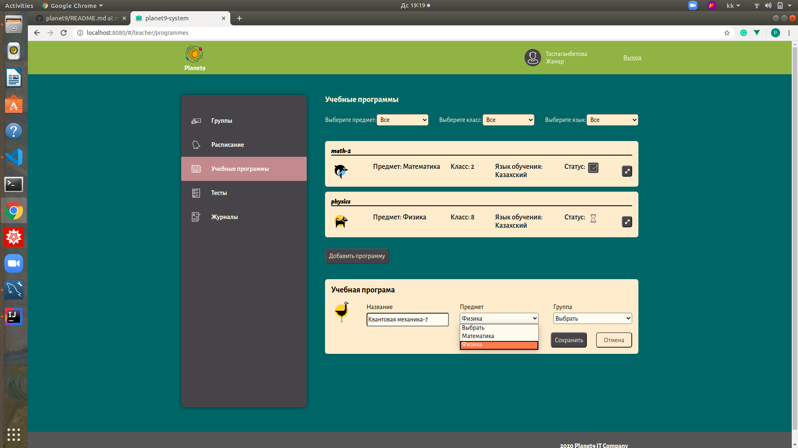
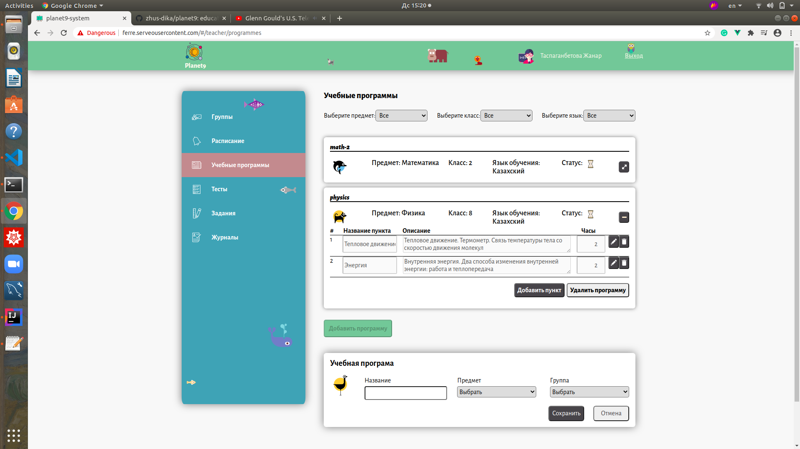
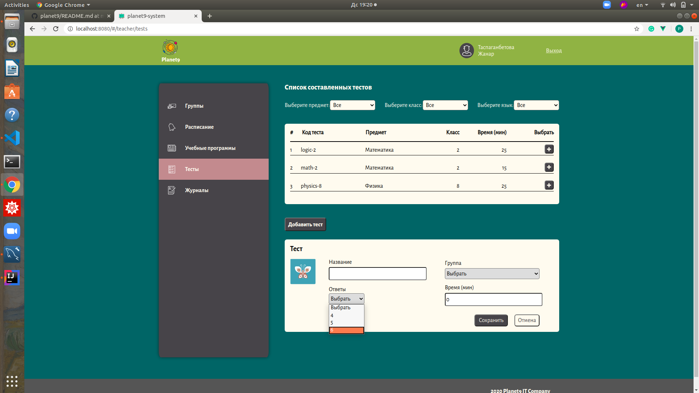
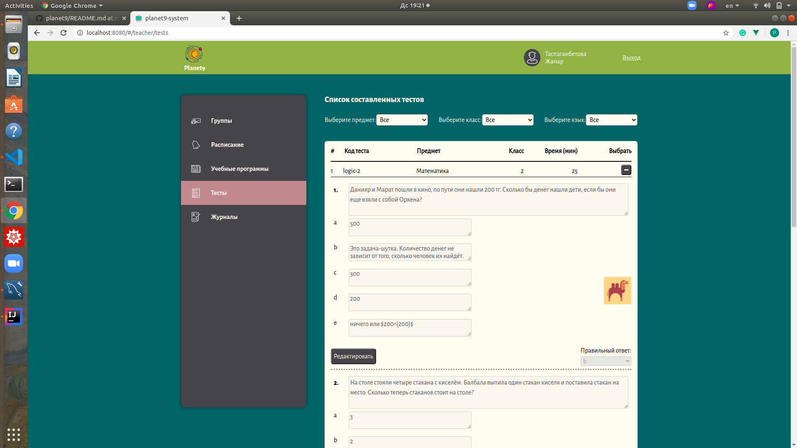
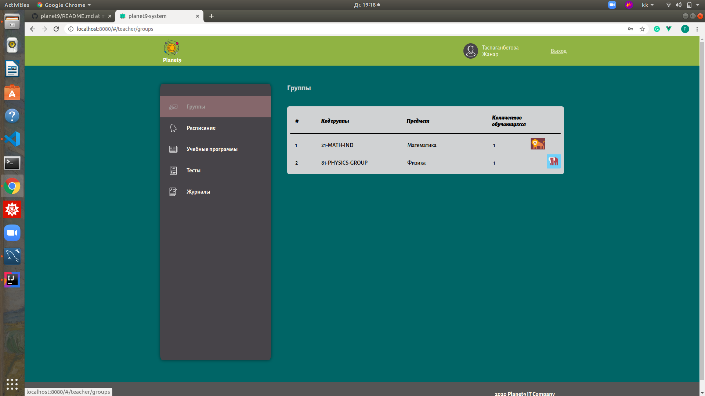
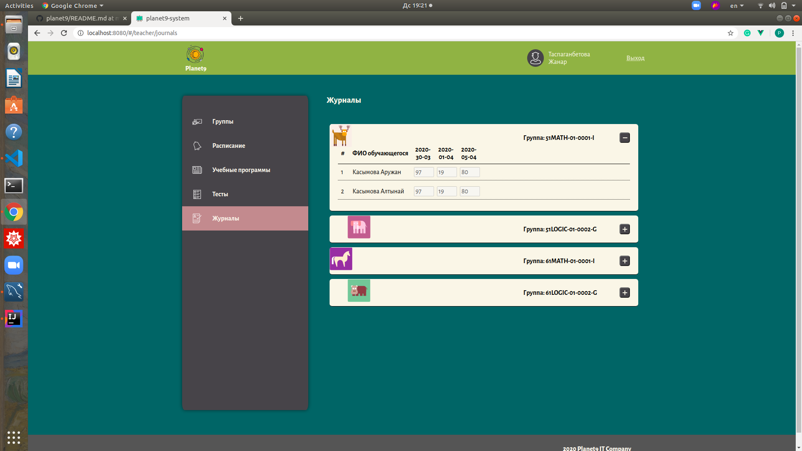
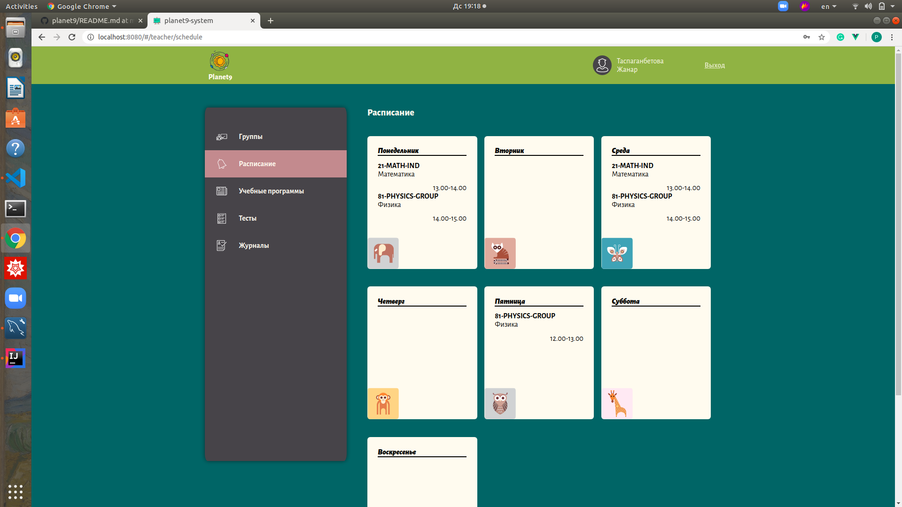

# planet9 - платформа для дошкольного и школьного образования :books:
***Версия: v1.0.0 (прототип)***

*Условные обозначения:* :anchor: - обязательно к ознакомлению, :bookmark: - можно и пропустить, :telescope: - полезно знать, :chart_with_upwards_trend: - в тренде, :key: - ключевой момент, :art: - подойти творчески, :link: - полезная ссылка, :performing_arts: - другой взгляд, :mountain_cableway: - лучше узнать.
## О платформе :anchor:

:heavy_plus_sign: инновационный подход к управлению учебным процессом

:heavy_plus_sign: оптимальные инструменты для управления учебным процессом

:heavy_plus_sign: удобный интерфейс

:heavy_plus_sign: возможность дистанционного обучения

:heavy_plus_sign: учет персонала и обучающихся

:heavy_plus_sign: ведение электронного журнала

:heavy_plus_sign: смарт методика распределения нагрузки преподавателей

:heavy_plus_sign: формирование отчетов и статистики для мониторинга качественного обучения

## Краткое руководство пользователя :key:

**1. Вводная часть**

  [1.1 Основные роли платформы](https://github.com/zhus-dika/planet9#11-%D0%BE%D1%81%D0%BD%D0%BE%D0%B2%D0%BD%D1%8B%D0%B5-%D1%80%D0%BE%D0%BB%D0%B8-%D0%BF%D0%BB%D0%B0%D1%82%D1%84%D0%BE%D1%80%D0%BC%D1%8B)
  
  [1.2 Структура платформы](https://github.com/zhus-dika/planet9#13-%D0%BE%D0%B1%D1%8A%D0%B5%D0%BA%D1%82%D1%8B-%D0%BF%D0%BB%D0%B0%D1%82%D1%84%D0%BE%D1%80%D0%BC%D1%8B-bookmark)
  
  [1.3 Объекты платформы](https://github.com/zhus-dika/planet9#13-%D0%BE%D0%B1%D1%8A%D0%B5%D0%BA%D1%82%D1%8B-%D0%BF%D0%BB%D0%B0%D1%82%D1%84%D0%BE%D1%80%D0%BC%D1%8B-bookmark)
  
  [1.4 Связи объектов](https://github.com/zhus-dika/planet9#14-%D1%81%D0%B2%D1%8F%D0%B7%D0%B8-%D0%BE%D0%B1%D1%8A%D0%B5%D0%BA%D1%82%D0%BE%D0%B2-telescope)
  
**2. Функционал для администратора**

  [2.1 Регистрация департамента, получение списка департаментов](https://github.com/zhus-dika/planet9#21-%D1%80%D0%B5%D0%B3%D0%B8%D1%81%D1%82%D1%80%D0%B0%D1%86%D0%B8%D1%8F-%D0%B4%D0%B5%D0%BF%D0%B0%D1%80%D1%82%D0%B0%D0%BC%D0%B5%D0%BD%D1%82%D0%B0-%D0%BF%D0%BE%D0%BB%D1%83%D1%87%D0%B5%D0%BD%D0%B8%D0%B5-%D1%81%D0%BF%D0%B8%D1%81%D0%BA%D0%B0-%D0%B4%D0%B5%D0%BF%D0%B0%D1%80%D1%82%D0%B0%D0%BC%D0%B5%D0%BD%D1%82%D0%BE%D0%B2)
  
  [2.2 Регистрация предмета, получение списка предметов](https://github.com/zhus-dika/planet9#22-%D1%80%D0%B5%D0%B3%D0%B8%D1%81%D1%82%D1%80%D0%B0%D1%86%D0%B8%D1%8F-%D0%BF%D1%80%D0%B5%D0%B4%D0%BC%D0%B5%D1%82%D0%B0-%D0%BF%D0%BE%D0%BB%D1%83%D1%87%D0%B5%D0%BD%D0%B8%D0%B5-%D1%81%D0%BF%D0%B8%D1%81%D0%BA%D0%B0-%D0%BF%D1%80%D0%B5%D0%B4%D0%BC%D0%B5%D1%82%D0%BE%D0%B2)
  
  [2.3 Регистрация ученика, получение списка учеников](https://github.com/zhus-dika/planet9#23-%D1%80%D0%B5%D0%B3%D0%B8%D1%81%D1%82%D1%80%D0%B0%D1%86%D0%B8%D1%8F-%D1%83%D1%87%D0%B5%D0%BD%D0%B8%D0%BA%D0%B0-%D0%BF%D0%BE%D0%BB%D1%83%D1%87%D0%B5%D0%BD%D0%B8%D0%B5-%D1%81%D0%BF%D0%B8%D1%81%D0%BA%D0%B0-%D1%83%D1%87%D0%B5%D0%BD%D0%B8%D0%BA%D0%BE%D0%B2)
  
  [2.4 Регистрация преподавателя, получение списка преподавателей](https://github.com/zhus-dika/planet9#24-%D1%80%D0%B5%D0%B3%D0%B8%D1%81%D1%82%D1%80%D0%B0%D1%86%D0%B8%D1%8F-%D0%BF%D1%80%D0%B5%D0%BF%D0%BE%D0%B4%D0%B0%D0%B2%D0%B0%D1%82%D0%B5%D0%BB%D1%8F-%D0%BF%D0%BE%D0%BB%D1%83%D1%87%D0%B5%D0%BD%D0%B8%D0%B5-%D1%81%D0%BF%D0%B8%D1%81%D0%BA%D0%B0-%D0%BF%D1%80%D0%B5%D0%BF%D0%BE%D0%B4%D0%B0%D0%B2%D0%B0%D1%82%D0%B5%D0%BB%D0%B5%D0%B9)
  
  [2.5 Регистрация группы, получение списка групп](https://github.com/zhus-dika/planet9#25-%D1%80%D0%B5%D0%B3%D0%B8%D1%81%D1%82%D1%80%D0%B0%D1%86%D0%B8%D1%8F-%D0%B3%D1%80%D1%83%D0%BF%D0%BF%D1%8B-%D0%BF%D0%BE%D0%BB%D1%83%D1%87%D0%B5%D0%BD%D0%B8%D0%B5-%D1%81%D0%BF%D0%B8%D1%81%D0%BA%D0%B0-%D0%B3%D1%80%D1%83%D0%BF%D0%BF)
  
  [2.6 Добавление и удаление ученика из группы](https://github.com/zhus-dika/planet9#26-%D0%B4%D0%BE%D0%B1%D0%B0%D0%B2%D0%BB%D0%B5%D0%BD%D0%B8%D0%B5-%D0%B8-%D1%83%D0%B4%D0%B0%D0%BB%D0%B5%D0%BD%D0%B8%D0%B5-%D1%83%D1%87%D0%B5%D0%BD%D0%B8%D0%BA%D0%B0-%D0%B8%D0%B7-%D0%B3%D1%80%D1%83%D0%BF%D0%BF%D1%8B)
  
  [2.7 Получение списка учебных программ и редактирование, активирование программ](https://github.com/zhus-dika/planet9#27-%D0%BF%D0%BE%D0%BB%D1%83%D1%87%D0%B5%D0%BD%D0%B8%D0%B5-%D1%81%D0%BF%D0%B8%D1%81%D0%BA%D0%B0-%D1%83%D1%87%D0%B5%D0%B1%D0%BD%D1%8B%D1%85-%D0%BF%D1%80%D0%BE%D0%B3%D1%80%D0%B0%D0%BC%D0%BC-%D0%B8-%D1%80%D0%B5%D0%B4%D0%B0%D0%BA%D1%82%D0%B8%D1%80%D0%BE%D0%B2%D0%B0%D0%BD%D0%B8%D0%B5-%D0%B0%D0%BA%D1%82%D0%B8%D0%B2%D0%B8%D1%80%D0%BE%D0%B2%D0%B0%D0%BD%D0%B8%D0%B5-%D0%BF%D1%80%D0%BE%D0%B3%D1%80%D0%B0%D0%BC%D0%BC)
  
  [2.8 Получение списка составленных тестов преподавателями](https://github.com/zhus-dika/planet9#28-%D0%BF%D0%BE%D0%BB%D1%83%D1%87%D0%B5%D0%BD%D0%B8%D0%B5-%D1%81%D0%BF%D0%B8%D1%81%D0%BA%D0%B0-%D1%81%D0%BE%D1%81%D1%82%D0%B0%D0%B2%D0%BB%D0%B5%D0%BD%D0%BD%D1%8B%D1%85-%D1%82%D0%B5%D1%81%D1%82%D0%BE%D0%B2-%D0%BF%D1%80%D0%B5%D0%BF%D0%BE%D0%B4%D0%B0%D0%B2%D0%B0%D1%82%D0%B5%D0%BB%D1%8F%D0%BC%D0%B8)
  
  [2.9 Получение списка журналов групп](https://github.com/zhus-dika/planet9#29-%D0%BF%D0%BE%D0%BB%D1%83%D1%87%D0%B5%D0%BD%D0%B8%D0%B5-%D1%81%D0%BF%D0%B8%D1%81%D0%BA%D0%B0-%D0%B6%D1%83%D1%80%D0%BD%D0%B0%D0%BB%D0%BE%D0%B2-%D0%B3%D1%80%D1%83%D0%BF%D0%BF)
  
  [2.10 Получение статистических данных в виде диаграмм, графиков](https://github.com/zhus-dika/planet9#210-%D0%BF%D0%BE%D0%BB%D1%83%D1%87%D0%B5%D0%BD%D0%B8%D0%B5-%D1%81%D1%82%D0%B0%D1%82%D0%B8%D1%81%D1%82%D0%B8%D1%87%D0%B5%D1%81%D0%BA%D0%B8%D1%85-%D0%B4%D0%B0%D0%BD%D0%BD%D1%8B%D1%85-%D0%B2-%D0%B2%D0%B8%D0%B4%D0%B5-%D0%B4%D0%B8%D0%B0%D0%B3%D1%80%D0%B0%D0%BC%D0%BC-%D0%B3%D1%80%D0%B0%D1%84%D0%B8%D0%BA%D0%BE%D0%B2)
  
**3. Функционал для преподавателя**

  [3.1 Добавление учебной программы, редактирование составленных программ](https://github.com/zhus-dika/planet9#31-%D0%B4%D0%BE%D0%B1%D0%B0%D0%B2%D0%BB%D0%B5%D0%BD%D0%B8%D0%B5-%D1%83%D1%87%D0%B5%D0%B1%D0%BD%D0%BE%D0%B9-%D0%BF%D1%80%D0%BE%D0%B3%D1%80%D0%B0%D0%BC%D0%BC%D1%8B-%D1%80%D0%B5%D0%B4%D0%B0%D0%BA%D1%82%D0%B8%D1%80%D0%BE%D0%B2%D0%B0%D0%BD%D0%B8%D0%B5-%D1%81%D0%BE%D1%81%D1%82%D0%B0%D0%B2%D0%BB%D0%B5%D0%BD%D0%BD%D1%8B%D1%85-%D0%BF%D1%80%D0%BE%D0%B3%D1%80%D0%B0%D0%BC%D0%BC)
  
  [3.2 Добавление теста для группы, редактирование составленных тестов](https://github.com/zhus-dika/planet9#32-%D0%B4%D0%BE%D0%B1%D0%B0%D0%B2%D0%BB%D0%B5%D0%BD%D0%B8%D0%B5-%D1%82%D0%B5%D1%81%D1%82%D0%B0-%D0%B4%D0%BB%D1%8F-%D0%B3%D1%80%D1%83%D0%BF%D0%BF%D1%8B-%D1%80%D0%B5%D0%B4%D0%B0%D0%BA%D1%82%D0%B8%D1%80%D0%BE%D0%B2%D0%B0%D0%BD%D0%B8%D0%B5-%D1%81%D0%BE%D1%81%D1%82%D0%B0%D0%B2%D0%BB%D0%B5%D0%BD%D0%BD%D1%8B%D1%85-%D1%82%D0%B5%D1%81%D1%82%D0%BE%D0%B2)
  
  [3.3 Получение списка групп](https://github.com/zhus-dika/planet9#33-%D0%BF%D0%BE%D0%BB%D1%83%D1%87%D0%B5%D0%BD%D0%B8%D0%B5-%D1%81%D0%BF%D0%B8%D1%81%D0%BA%D0%B0-%D0%B3%D1%80%D1%83%D0%BF%D0%BF)
  
  [3.4 Получение списка журналов](https://github.com/zhus-dika/planet9#34-%D0%BF%D0%BE%D0%BB%D1%83%D1%87%D0%B5%D0%BD%D0%B8%D0%B5-%D1%81%D0%BF%D0%B8%D1%81%D0%BA%D0%B0-%D0%B6%D1%83%D1%80%D0%BD%D0%B0%D0%BB%D0%BE%D0%B2)
  
  [3.5 Расписание](https://github.com/zhus-dika/planet9#35-%D1%80%D0%B0%D1%81%D0%BF%D0%B8%D1%81%D0%B0%D0%BD%D0%B8%D0%B5)
  
**4. Функционал для ученика**

  [4.1 Получение списка учебных программ]()
  
  [4.2 Получение списка пройденных тестов и прохождение тестов, выставленных для групп]()
  
  [4.3 Получение списка групп]()
  
  [4.4 Получение списка журналов]()
  
  [4.5 Расписание]()
  
#### 1.1 Основные роли платформы

 - Администратор  :bust_in_silhouette:
 
 - Ученик :girl: :boy:
 
 - Преподаватель :man: :woman:
 
#### 1.2 Структура платформы :telescope:
```
                  П л а т ф о р м а
                  =================
                   /       \       \ 
                 /          \       Профиль пользователя
    Главная страница         \      ====================
    ================          \
                               М е н ю 
                               ======= ---> Статистика
                                       ---> Журналы
                                       ---> Учебные программы
                                       ---> Тесты
                                       ---> Группы
```
#### 1.3 Объекты платформы :bookmark:
```
+++ Администратор +++ Ученики +++ преподаватели +++ департаменты +++ предметы +++ группы +++
+++ группы +++ журналы +++ тесты +++ учебные программы +++ диаграммы +++
```
#### 1.4 Связи объектов :telescope:
```
Администратор ---> Ученик
Администратор ---> Преподаватель
Преподаватель <---> Ученик
Департамент ---> Преподаватель
Группа <---> Преподаватель
Группа <---> Ученик
Департамент <---> Группа
Департамент ---> Предмет
```
#### 2.1 Регистрация департамента, получение списка департаментов

#### 2.2 Регистрация предмета, получение списка предметов

#### 2.3 Регистрация ученика, получение списка учеников

#### 2.4 Регистрация преподавателя, получение списка преподавателей

#### 2.5 Регистрация группы, получение списка групп


#### 2.6 Добавление и удаление ученика из группы


#### 2.7 Получение списка учебных программ и редактирование, активирование программ

#### 2.8 Получение списка составленных тестов преподавателями

#### 2.9 Получение списка журналов групп

#### 2.10 Получение статистических данных в виде диаграмм, графиков


#### 3.1 Добавление учебной программы, редактирование составленных программ



#### 3.2 Добавление теста для группы, редактирование составленных тестов



#### 3.3 Получение списка групп


#### 3.4 Получение списка журналов


#### 3.5 Расписание


Мы любим :octocat:
