# planet9 - платформа для дошкольного и школьного образования :books:
***Версия: v1.0.0 (прототип)***

*Условные обозначения:* :anchor: - обязательно к ознакомлению, :bookmark: - можно и пропустить, :telescope: - полезно знать, :chart_with_upwards_trend: - в тренде, :key: - ключевой момент, :art: - подойти творчески, :link: - полезная ссылка, :performing_arts: - другой взгляд, :mountain_cableway: - лучше узнать.
## О платформе :anchor:

:heavy_plus_sign: инновационный подход к управлению учебным процессом

:heavy_plus_sign: оптимальные инструменты для управления учебным процессом

:heavy_plus_sign: удобный интерфейс

:heavy_plus_sign: возможность дистанционного обучения

:heavy_plus_sign: учет персонала и обучающихся

:heavy_plus_sign: ведение электронного журнала

:heavy_plus_sign: смарт методика распределения нагрузки преподавателей

:heavy_plus_sign: формирование отчетов и статистики для мониторинга качественного обучения

## Краткое руководство пользователя :key:
[1.3 Объекты платформы](https://github.com/zhus-dika/planet9#13-%D0%BE%D0%B1%D1%8A%D0%B5%D0%BA%D1%82%D1%8B-%D0%BF%D0%BB%D0%B0%D1%82%D1%84%D0%BE%D1%80%D0%BC%D1%8B-bookmark)
```
1. Вводная часть
  1.1 Основные роли платформы
  1.2 Структура платформы
  1.3 Объекты платформы
  1.4 Связи объектов
2. Функционал для администратора
  2.1 Регистрация департамента, получение списка департаментов
  2.2 Регистрация предмета, получение списка предметов
  2.3 Регистрация ученика, получение списка учеников
  2.4 Регистрация преподавателя, получение списка преподавателей
  2.5 Регистрация группы, получение списка групп
  2.6 Добавление и удаление ученика из группы
  2.7 Получение списка учебных программ и редактирование, активирование программ
  2.8 Получение списка составленных тестов преподавателями
  2.9 Получение списка журналов групп
  2.10 Получение статистических данных в виде диаграмм, графиков
3. Функционал для преподавателя
  3.1 Добавление учебной программы, редактирование составленных программ
  3.2 Добавление теста для группы, редактирование составленных тестов
  3.3 Получение списка групп
  3.4 Получение списка журналов
  3.5 Расписание
4. Функционал для ученика
  4.1 Получение списка учебных программ
  4.2 Получение списка пройденных тестов и прохождение тестов, выставленных для групп
  4.3 Получение списка групп
  4.4 Получение списка журналов
  4.5 Расписание
 ```
#### 1.1 Основные роли платформы

 - Администратор  :bust_in_silhouette:
 
 - Ученик :girl: :boy:
 
 - Преподаватель :man: :woman:
 
#### 1.2 Структура платформы :telescope:
```
                  П л а т ф о р м а
                  =================
                   /       \       \ 
                 /          \       Профиль пользователя
    Главная страница         \      ====================
    ================          \
                               М е н ю 
                               ======= ---> Статистика
                                       ---> Журналы
                                       ---> Учебные программы
                                       ---> Тесты
                                       ---> Группы
```
#### 1.3 Объекты платформы :bookmark:
```
+++ Администратор +++ Ученики +++ преподаватели +++ департаменты +++ предметы +++ группы +++
+++ группы +++ журналы +++ тесты +++ учебные программы +++ диаграммы +++
```
#### 1.4 Связи объектов :telescope:
```
Администратор ---> Ученик
Администратор ---> Преподаватель
Преподаватель <---> Ученик
Департамент ---> Преподаватель
Группа <---> Преподаватель
Группа <---> Ученик
Департамент <---> Группа
Департамент ---> Предмет
```
#### 2.1 Регистрация департамента, получение списка департаментов
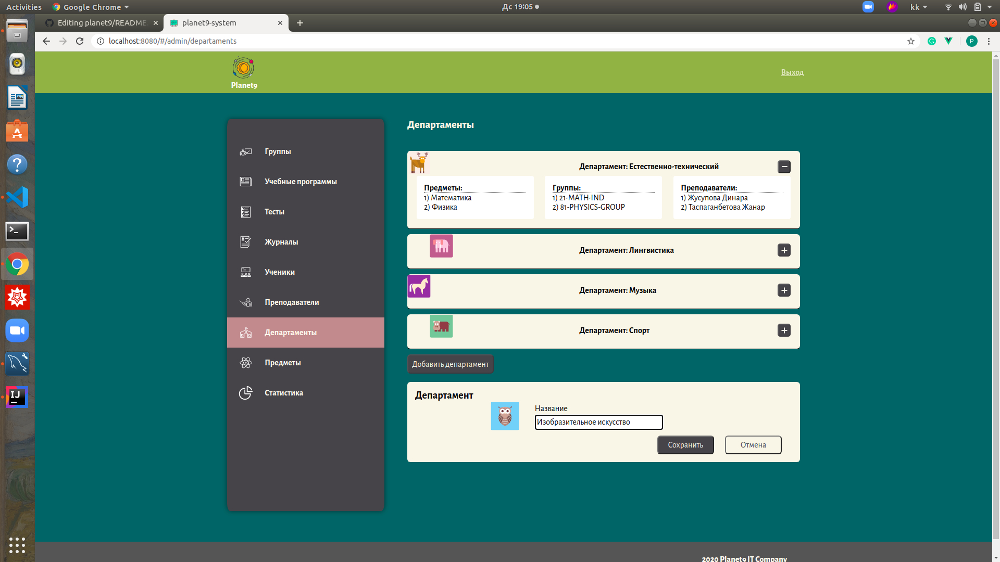
#### 2.2 Регистрация предмета, получение списка предметов
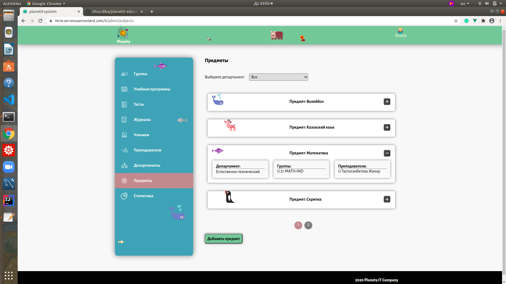
#### 2.3 Регистрация ученика, получение списка учеников
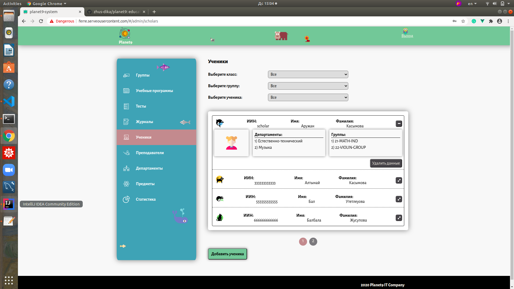
#### 2.4 Регистрация преподавателя, получение списка преподавателей
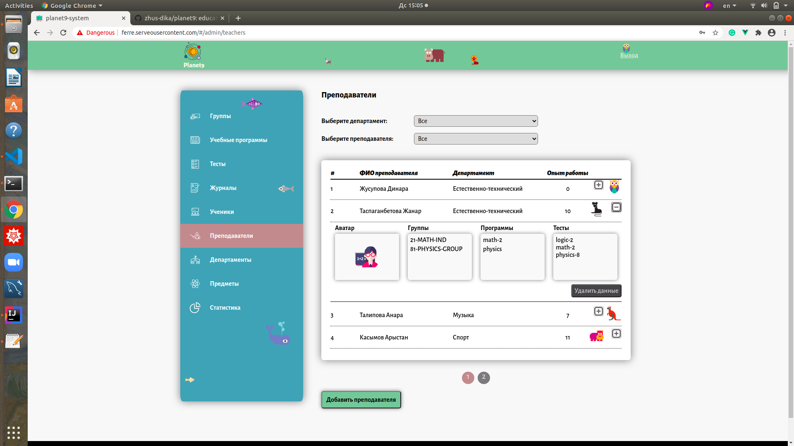
#### 2.5 Регистрация группы, получение списка групп
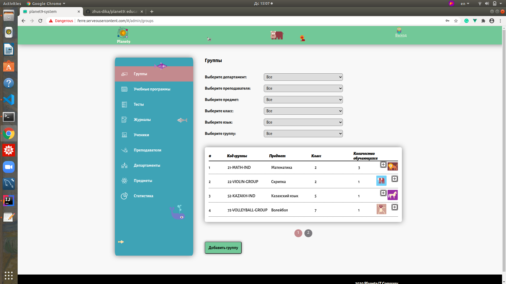
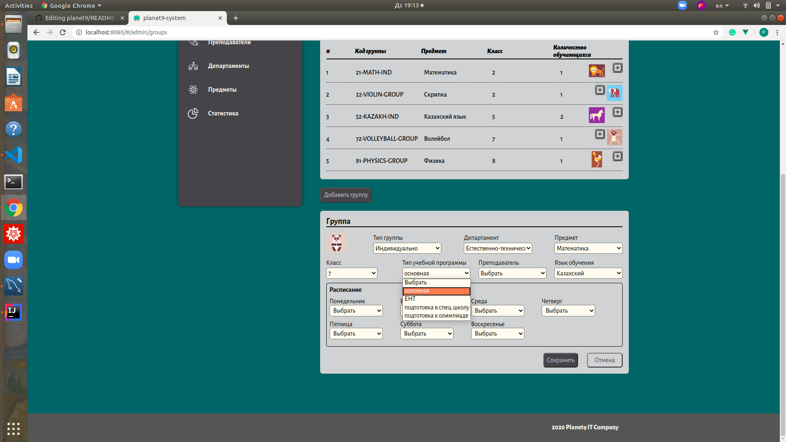
#### 2.6 Добавление и удаление ученика из группы
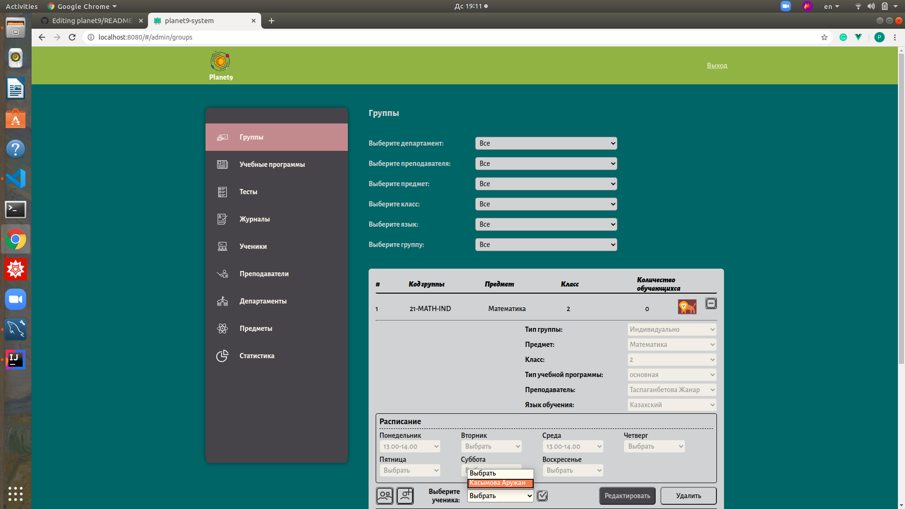
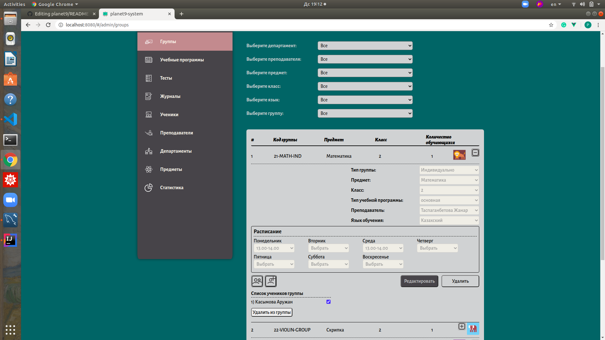
#### 2.7 Получение списка учебных программ и редактирование, активирование программ

#### 2.8 Получение списка составленных тестов преподавателями
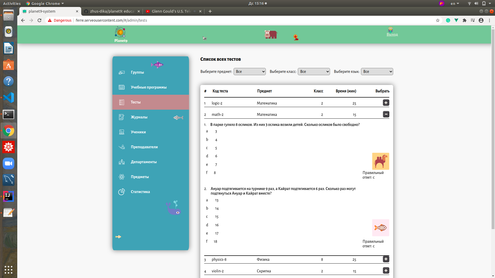
#### 2.9 Получение списка журналов групп
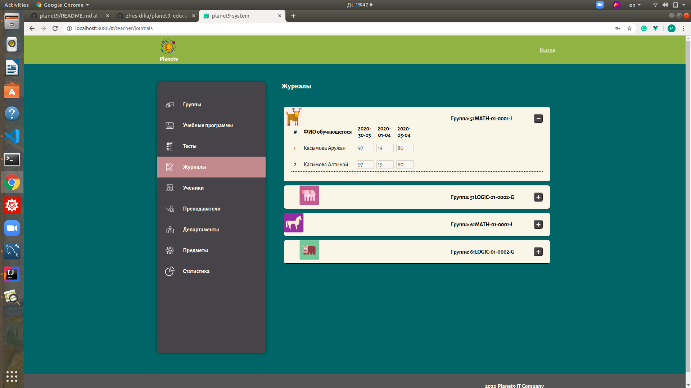
#### 2.10 Получение статистических данных в виде диаграмм, графиков
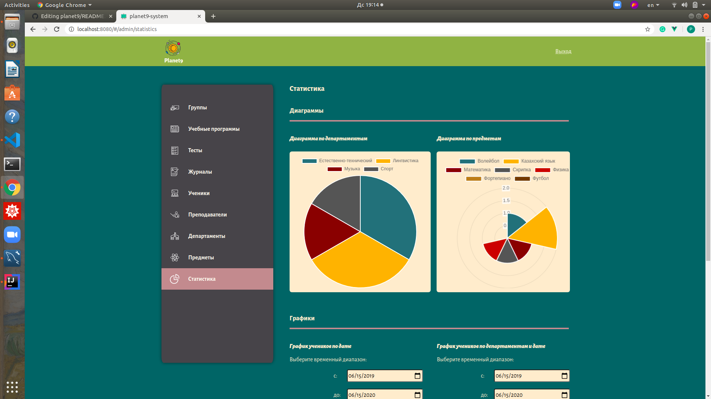
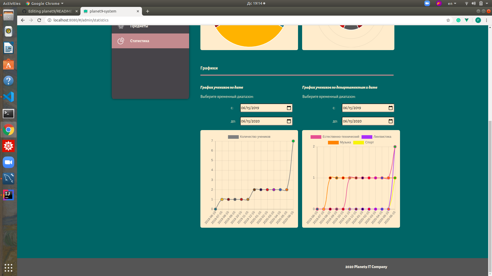

Мы любим :octocat:
