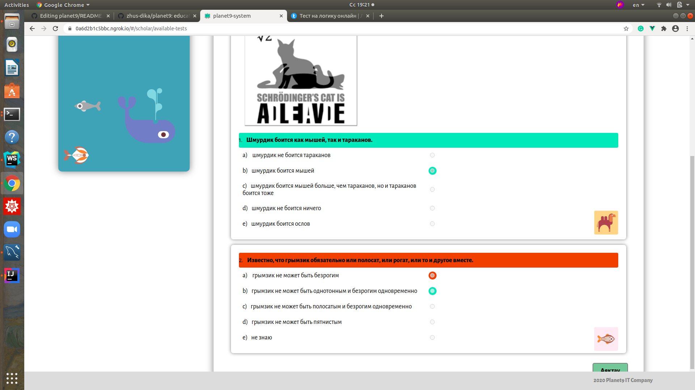

# planet9 - платформа для дошкольного и школьного образования :books:
***Версия: v1.1.2 (прототип)***

*Условные обозначения:* :anchor: - обязательно к ознакомлению, :bookmark: - можно и пропустить, :telescope: - полезно знать, :chart_with_upwards_trend: - в тренде, :key: - ключевой момент, :art: - подойти творчески, :link: - полезная ссылка, :performing_arts: - другой взгляд, :mountain_cableway: - лучше узнать.

Платформа написана на трех языках: казахском, русском и английском.

Перейти :point_right: [planet9](https://b53704e2e051.ngrok.io)

## О платформе :anchor:

:heavy_plus_sign: инновационный подход к управлению учебным процессом

:heavy_plus_sign: оптимальные инструменты для управления учебным процессом

:heavy_plus_sign: удобный интерфейс

:heavy_plus_sign: возможность работать на казахском, русском и английском языках

:heavy_plus_sign: возможность дистанционного обучения

:heavy_plus_sign: учет персонала и обучающихся

:heavy_plus_sign: ведение электронного журнала

:heavy_plus_sign: смарт методика распределения нагрузки преподавателей

:heavy_plus_sign: формирование отчетов и статистики для мониторинга качественного обучения

## Краткое руководство пользователя :key:

**1. Вводная часть**

  [1.1 Основные роли платформы](https://github.com/zhus-dika/planet9#11-%D0%BE%D1%81%D0%BD%D0%BE%D0%B2%D0%BD%D1%8B%D0%B5-%D1%80%D0%BE%D0%BB%D0%B8-%D0%BF%D0%BB%D0%B0%D1%82%D1%84%D0%BE%D1%80%D0%BC%D1%8B)
  
  [1.2 Структура платформы](https://github.com/zhus-dika/planet9#13-%D0%BE%D0%B1%D1%8A%D0%B5%D0%BA%D1%82%D1%8B-%D0%BF%D0%BB%D0%B0%D1%82%D1%84%D0%BE%D1%80%D0%BC%D1%8B-bookmark)
  
  [1.3 Объекты платформы](https://github.com/zhus-dika/planet9#13-%D0%BE%D0%B1%D1%8A%D0%B5%D0%BA%D1%82%D1%8B-%D0%BF%D0%BB%D0%B0%D1%82%D1%84%D0%BE%D1%80%D0%BC%D1%8B-bookmark)
  
  [1.4 Связи объектов](https://github.com/zhus-dika/planet9#14-%D1%81%D0%B2%D1%8F%D0%B7%D0%B8-%D0%BE%D0%B1%D1%8A%D0%B5%D0%BA%D1%82%D0%BE%D0%B2-telescope)
  
**2. Функционал для администратора** :telescope:

  [2.1 Регистрация департамента, получение списка департаментов, редактирование](https://github.com/zhus-dika/planet9#21-%D1%80%D0%B5%D0%B3%D0%B8%D1%81%D1%82%D1%80%D0%B0%D1%86%D0%B8%D1%8F-%D0%B4%D0%B5%D0%BF%D0%B0%D1%80%D1%82%D0%B0%D0%BC%D0%B5%D0%BD%D1%82%D0%B0-%D0%BF%D0%BE%D0%BB%D1%83%D1%87%D0%B5%D0%BD%D0%B8%D0%B5-%D1%81%D0%BF%D0%B8%D1%81%D0%BA%D0%B0-%D0%B4%D0%B5%D0%BF%D0%B0%D1%80%D1%82%D0%B0%D0%BC%D0%B5%D0%BD%D1%82%D0%BE%D0%B2)
  
  [2.2 Регистрация предмета, получение списка предметов, редактирование](https://github.com/zhus-dika/planet9#22-%D1%80%D0%B5%D0%B3%D0%B8%D1%81%D1%82%D1%80%D0%B0%D1%86%D0%B8%D1%8F-%D0%BF%D1%80%D0%B5%D0%B4%D0%BC%D0%B5%D1%82%D0%B0-%D0%BF%D0%BE%D0%BB%D1%83%D1%87%D0%B5%D0%BD%D0%B8%D0%B5-%D1%81%D0%BF%D0%B8%D1%81%D0%BA%D0%B0-%D0%BF%D1%80%D0%B5%D0%B4%D0%BC%D0%B5%D1%82%D0%BE%D0%B2-%D1%80%D0%B5%D0%B4%D0%B0%D0%BA%D1%82%D0%B8%D1%80%D0%BE%D0%B2%D0%B0%D0%BD%D0%B8%D0%B5)
  
  [2.3 Регистрация ученика, получение списка учеников, редактирование](https://github.com/zhus-dika/planet9#23-%D1%80%D0%B5%D0%B3%D0%B8%D1%81%D1%82%D1%80%D0%B0%D1%86%D0%B8%D1%8F-%D1%83%D1%87%D0%B5%D0%BD%D0%B8%D0%BA%D0%B0-%D0%BF%D0%BE%D0%BB%D1%83%D1%87%D0%B5%D0%BD%D0%B8%D0%B5-%D1%81%D0%BF%D0%B8%D1%81%D0%BA%D0%B0-%D1%83%D1%87%D0%B5%D0%BD%D0%B8%D0%BA%D0%BE%D0%B2-%D1%80%D0%B5%D0%B4%D0%B0%D0%BA%D1%82%D0%B8%D1%80%D0%BE%D0%B2%D0%B0%D0%BD%D0%B8%D0%B5)
  
  [2.4 Регистрация преподавателя, получение списка преподавателей, редактирование](https://github.com/zhus-dika/planet9#24-%D1%80%D0%B5%D0%B3%D0%B8%D1%81%D1%82%D1%80%D0%B0%D1%86%D0%B8%D1%8F-%D0%BF%D1%80%D0%B5%D0%BF%D0%BE%D0%B4%D0%B0%D0%B2%D0%B0%D1%82%D0%B5%D0%BB%D1%8F-%D0%BF%D0%BE%D0%BB%D1%83%D1%87%D0%B5%D0%BD%D0%B8%D0%B5-%D1%81%D0%BF%D0%B8%D1%81%D0%BA%D0%B0-%D0%BF%D1%80%D0%B5%D0%BF%D0%BE%D0%B4%D0%B0%D0%B2%D0%B0%D1%82%D0%B5%D0%BB%D0%B5%D0%B9-%D1%80%D0%B5%D0%B4%D0%B0%D0%BA%D1%82%D0%B8%D1%80%D0%BE%D0%B2%D0%B0%D0%BD%D0%B8%D0%B5)
  
  [2.5 Регистрация группы, получение списка групп, редактирование](https://github.com/zhus-dika/planet9#25-%D1%80%D0%B5%D0%B3%D0%B8%D1%81%D1%82%D1%80%D0%B0%D1%86%D0%B8%D1%8F-%D0%B3%D1%80%D1%83%D0%BF%D0%BF%D1%8B-%D0%BF%D0%BE%D0%BB%D1%83%D1%87%D0%B5%D0%BD%D0%B8%D0%B5-%D1%81%D0%BF%D0%B8%D1%81%D0%BA%D0%B0-%D0%B3%D1%80%D1%83%D0%BF%D0%BF-%D1%80%D0%B5%D0%B4%D0%B0%D0%BA%D1%82%D0%B8%D1%80%D0%BE%D0%B2%D0%B0%D0%BD%D0%B8%D0%B5)
  
  [2.6 Добавление и удаление ученика из группы](https://github.com/zhus-dika/planet9#26-%D0%B4%D0%BE%D0%B1%D0%B0%D0%B2%D0%BB%D0%B5%D0%BD%D0%B8%D0%B5-%D0%B8-%D1%83%D0%B4%D0%B0%D0%BB%D0%B5%D0%BD%D0%B8%D0%B5-%D1%83%D1%87%D0%B5%D0%BD%D0%B8%D0%BA%D0%B0-%D0%B8%D0%B7-%D0%B3%D1%80%D1%83%D0%BF%D0%BF%D1%8B)
  
  [2.7 Получение списка учебных программ и редактирование, активирование программ](https://github.com/zhus-dika/planet9#27-%D0%BF%D0%BE%D0%BB%D1%83%D1%87%D0%B5%D0%BD%D0%B8%D0%B5-%D1%81%D0%BF%D0%B8%D1%81%D0%BA%D0%B0-%D1%83%D1%87%D0%B5%D0%B1%D0%BD%D1%8B%D1%85-%D0%BF%D1%80%D0%BE%D0%B3%D1%80%D0%B0%D0%BC%D0%BC-%D0%B8-%D1%80%D0%B5%D0%B4%D0%B0%D0%BA%D1%82%D0%B8%D1%80%D0%BE%D0%B2%D0%B0%D0%BD%D0%B8%D0%B5-%D0%B0%D0%BA%D1%82%D0%B8%D0%B2%D0%B8%D1%80%D0%BE%D0%B2%D0%B0%D0%BD%D0%B8%D0%B5-%D0%BF%D1%80%D0%BE%D0%B3%D1%80%D0%B0%D0%BC%D0%BC)
  
  [2.8 Получение списка составленных тестов преподавателями](https://github.com/zhus-dika/planet9#28-%D0%BF%D0%BE%D0%BB%D1%83%D1%87%D0%B5%D0%BD%D0%B8%D0%B5-%D1%81%D0%BF%D0%B8%D1%81%D0%BA%D0%B0-%D1%81%D0%BE%D1%81%D1%82%D0%B0%D0%B2%D0%BB%D0%B5%D0%BD%D0%BD%D1%8B%D1%85-%D1%82%D0%B5%D1%81%D1%82%D0%BE%D0%B2-%D0%BF%D1%80%D0%B5%D0%BF%D0%BE%D0%B4%D0%B0%D0%B2%D0%B0%D1%82%D0%B5%D0%BB%D1%8F%D0%BC%D0%B8)
  
  [2.9 Получение списка журналов групп](https://github.com/zhus-dika/planet9#29-%D0%BF%D0%BE%D0%BB%D1%83%D1%87%D0%B5%D0%BD%D0%B8%D0%B5-%D1%81%D0%BF%D0%B8%D1%81%D0%BA%D0%B0-%D0%B6%D1%83%D1%80%D0%BD%D0%B0%D0%BB%D0%BE%D0%B2-%D0%B3%D1%80%D1%83%D0%BF%D0%BF-%D0%BF%D1%80%D0%BE%D1%81%D0%BC%D0%BE%D1%82%D1%80-%D1%81%D1%82%D0%B0%D1%82%D0%B8%D1%81%D1%82%D0%B8%D0%BA%D0%B8-%D0%BF%D0%BE-%D0%B3%D1%80%D1%83%D0%BF%D0%BF%D0%B5-%D0%B8-%D0%BF%D0%BE%D0%BB%D1%83%D1%87%D0%B5%D0%BD%D0%B8%D0%B5-%D1%81%D1%80%D0%B5%D0%B4%D0%BD%D0%B8%D1%85-%D0%BE%D1%86%D0%B5%D0%BD%D0%BE%D0%BA-%D1%83%D1%87%D0%B5%D0%BD%D0%B8%D0%BA%D0%BE%D0%B2)
  
  [2.10 Получение статистических данных в виде диаграмм, графиков](https://github.com/zhus-dika/planet9#210-%D0%BF%D0%BE%D0%BB%D1%83%D1%87%D0%B5%D0%BD%D0%B8%D0%B5-%D1%81%D1%82%D0%B0%D1%82%D0%B8%D1%81%D1%82%D0%B8%D1%87%D0%B5%D1%81%D0%BA%D0%B8%D1%85-%D0%B4%D0%B0%D0%BD%D0%BD%D1%8B%D1%85-%D0%B2-%D0%B2%D0%B8%D0%B4%D0%B5-%D0%B4%D0%B8%D0%B0%D0%B3%D1%80%D0%B0%D0%BC%D0%BC-%D0%B3%D1%80%D0%B0%D1%84%D0%B8%D0%BA%D0%BE%D0%B2) :chart_with_upwards_trend:
  
  [2.11 Профиль школы](https://github.com/zhus-dika/planet9#211-%D0%BF%D1%80%D0%BE%D1%84%D0%B8%D0%BB%D1%8C-%D1%88%D0%BA%D0%BE%D0%BB%D1%8B) :art:
  
  [2.12 Добавление объявления для школы, редактирование](https://github.com/zhus-dika/planet9#211-%D0%BF%D1%80%D0%BE%D1%84%D0%B8%D0%BB%D1%8C-%D1%88%D0%BA%D0%BE%D0%BB%D1%8B) :chart_with_upwards_trend:
  
**3. Функционал для преподавателя** :mountain_cableway:

  [3.1 Добавление учебной программы, редактирование составленных программ, загрузка учебных материалов](https://github.com/zhus-dika/planet9#31-%D0%B4%D0%BE%D0%B1%D0%B0%D0%B2%D0%BB%D0%B5%D0%BD%D0%B8%D0%B5-%D1%83%D1%87%D0%B5%D0%B1%D0%BD%D0%BE%D0%B9-%D0%BF%D1%80%D0%BE%D0%B3%D1%80%D0%B0%D0%BC%D0%BC%D1%8B-%D1%80%D0%B5%D0%B4%D0%B0%D0%BA%D1%82%D0%B8%D1%80%D0%BE%D0%B2%D0%B0%D0%BD%D0%B8%D0%B5-%D1%81%D0%BE%D1%81%D1%82%D0%B0%D0%B2%D0%BB%D0%B5%D0%BD%D0%BD%D1%8B%D1%85-%D0%BF%D1%80%D0%BE%D0%B3%D1%80%D0%B0%D0%BC%D0%BC-%D0%B7%D0%B0%D0%B3%D1%80%D1%83%D0%B7%D0%BA%D0%B0-%D1%83%D1%87%D0%B5%D0%B1%D0%BD%D1%8B%D1%85-%D0%BC%D0%B0%D1%82%D0%B5%D1%80%D0%B8%D0%B0%D0%BB%D0%BE%D0%B2) :art:
  
  [3.2 Добавление теста для группы, редактирование составленных тестов](https://github.com/zhus-dika/planet9#32-%D0%B4%D0%BE%D0%B1%D0%B0%D0%B2%D0%BB%D0%B5%D0%BD%D0%B8%D0%B5-%D1%82%D0%B5%D1%81%D1%82%D0%B0-%D0%B4%D0%BB%D1%8F-%D0%B3%D1%80%D1%83%D0%BF%D0%BF%D1%8B-%D1%80%D0%B5%D0%B4%D0%B0%D0%BA%D1%82%D0%B8%D1%80%D0%BE%D0%B2%D0%B0%D0%BD%D0%B8%D0%B5-%D1%81%D0%BE%D1%81%D1%82%D0%B0%D0%B2%D0%BB%D0%B5%D0%BD%D0%BD%D1%8B%D1%85-%D1%82%D0%B5%D1%81%D1%82%D0%BE%D0%B2)
  
  [3.3 Добавление задания для группы, редактирование составленных заданий](https://github.com/zhus-dika/planet9#33-%D0%B4%D0%BE%D0%B1%D0%B0%D0%B2%D0%BB%D0%B5%D0%BD%D0%B8%D0%B5-%D0%B7%D0%B0%D0%B4%D0%B0%D0%BD%D0%B8%D1%8F-%D0%B4%D0%BB%D1%8F-%D0%B3%D1%80%D1%83%D0%BF%D0%BF%D1%8B-%D1%80%D0%B5%D0%B4%D0%B0%D0%BA%D1%82%D0%B8%D1%80%D0%BE%D0%B2%D0%B0%D0%BD%D0%B8%D0%B5-%D1%81%D0%BE%D1%81%D1%82%D0%B0%D0%B2%D0%BB%D0%B5%D0%BD%D0%BD%D1%8B%D1%85-%D0%B7%D0%B0%D0%B4%D0%B0%D0%BD%D0%B8%D0%B9) :key:
  
  [3.4 Проверка выполненых заданий учеников группы, загрузка файлов выполненных работ учеников](https://github.com/zhus-dika/planet9#34-%D0%BF%D1%80%D0%BE%D0%B2%D0%B5%D1%80%D0%BA%D0%B0-%D0%B2%D1%8B%D0%BF%D0%BE%D0%BB%D0%BD%D0%B5%D0%BD%D1%8B%D1%85-%D0%B7%D0%B0%D0%B4%D0%B0%D0%BD%D0%B8%D0%B9-%D1%83%D1%87%D0%B5%D0%BD%D0%B8%D0%BA%D0%BE%D0%B2-%D0%B3%D1%80%D1%83%D0%BF%D0%BF%D1%8B-%D0%B7%D0%B0%D0%B3%D1%80%D1%83%D0%B7%D0%BA%D0%B0-%D1%84%D0%B0%D0%B9%D0%BB%D0%BE%D0%B2-%D0%B2%D1%8B%D0%BF%D0%BE%D0%BB%D0%BD%D0%B5%D0%BD%D0%BD%D1%8B%D1%85-%D1%80%D0%B0%D0%B1%D0%BE%D1%82-%D1%83%D1%87%D0%B5%D0%BD%D0%B8%D0%BA%D0%BE%D0%B2) :art: 
  
  [3.5 Выставление оценок](https://github.com/zhus-dika/planet9#35-%D0%B2%D1%8B%D1%81%D1%82%D0%B0%D0%B2%D0%BB%D0%B5%D0%BD%D0%B8%D0%B5-%D0%BE%D1%86%D0%B5%D0%BD%D0%BE%D0%BA) 
  
  [3.6 Получение списка групп](https://github.com/zhus-dika/planet9#36-%D0%BF%D0%BE%D0%BB%D1%83%D1%87%D0%B5%D0%BD%D0%B8%D0%B5-%D1%81%D0%BF%D0%B8%D1%81%D0%BA%D0%B0-%D0%B3%D1%80%D1%83%D0%BF%D0%BF)
  
  [3.7 Получение списка журналов](https://github.com/zhus-dika/planet9#37-%D0%BF%D0%BE%D0%BB%D1%83%D1%87%D0%B5%D0%BD%D0%B8%D0%B5-%D1%81%D0%BF%D0%B8%D1%81%D0%BA%D0%B0-%D0%B6%D1%83%D1%80%D0%BD%D0%B0%D0%BB%D0%BE%D0%B2)
  
  [3.8 Расписание](https://github.com/zhus-dika/planet9#38-%D1%80%D0%B0%D1%81%D0%BF%D0%B8%D1%81%D0%B0%D0%BD%D0%B8%D0%B5) :performing_arts:
  
  [3.9 Профиль преподавателя](https://github.com/zhus-dika/planet9#39-%D0%BF%D1%80%D0%BE%D1%84%D0%B8%D0%BB%D1%8C-%D0%BF%D1%80%D0%B5%D0%BF%D0%BE%D0%B4%D0%B0%D0%B2%D0%B0%D1%82%D0%B5%D0%BB%D1%8F) :art:
  
**4. Функционал для ученика** :mountain_cableway:

  [4.1 Получение списка учебных программ, работа с учебными материалами](https://github.com/zhus-dika/planet9#41-%D0%BF%D0%BE%D0%BB%D1%83%D1%87%D0%B5%D0%BD%D0%B8%D0%B5-%D1%81%D0%BF%D0%B8%D1%81%D0%BA%D0%B0-%D1%83%D1%87%D0%B5%D0%B1%D0%BD%D1%8B%D1%85-%D0%BF%D1%80%D0%BE%D0%B3%D1%80%D0%B0%D0%BC%D0%BC-%D1%80%D0%B0%D0%B1%D0%BE%D1%82%D0%B0-%D1%81-%D1%83%D1%87%D0%B5%D0%B1%D0%BD%D1%8B%D0%BC%D0%B8-%D0%BC%D0%B0%D1%82%D0%B5%D1%80%D0%B8%D0%B0%D0%BB%D0%B0%D0%BC%D0%B8)
  
  [4.2 Получение списка пройденных тестов и прохождение тестов, выставленных для групп](https://github.com/zhus-dika/planet9#42-%D0%BF%D0%BE%D0%BB%D1%83%D1%87%D0%B5%D0%BD%D0%B8%D0%B5-%D1%81%D0%BF%D0%B8%D1%81%D0%BA%D0%B0-%D0%BF%D1%80%D0%BE%D0%B9%D0%B4%D0%B5%D0%BD%D0%BD%D1%8B%D1%85-%D1%82%D0%B5%D1%81%D1%82%D0%BE%D0%B2-%D0%B8-%D0%BF%D1%80%D0%BE%D1%85%D0%BE%D0%B6%D0%B4%D0%B5%D0%BD%D0%B8%D0%B5-%D1%82%D0%B5%D1%81%D1%82%D0%BE%D0%B2-%D0%B2%D1%8B%D1%81%D1%82%D0%B0%D0%B2%D0%BB%D0%B5%D0%BD%D0%BD%D1%8B%D1%85-%D0%B4%D0%BB%D1%8F-%D0%B3%D1%80%D1%83%D0%BF%D0%BF)
  
  [4.3 Получение списка выполненных заданий с оценками, выставленными преподавателями и комментариями](https://github.com/zhus-dika/planet9#43-%D0%BF%D0%BE%D0%BB%D1%83%D1%87%D0%B5%D0%BD%D0%B8%D0%B5-%D1%81%D0%BF%D0%B8%D1%81%D0%BA%D0%B0-%D0%B2%D1%8B%D0%BF%D0%BE%D0%BB%D0%BD%D0%B5%D0%BD%D0%BD%D1%8B%D1%85-%D0%B7%D0%B0%D0%B4%D0%B0%D0%BD%D0%B8%D0%B9-%D1%81-%D0%BE%D1%86%D0%B5%D0%BD%D0%BA%D0%B0%D0%BC%D0%B8-%D0%B2%D1%8B%D1%81%D1%82%D0%B0%D0%B2%D0%BB%D0%B5%D0%BD%D0%BD%D1%8B%D0%BC%D0%B8-%D0%BF%D1%80%D0%B5%D0%BF%D0%BE%D0%B4%D0%B0%D0%B2%D0%B0%D1%82%D0%B5%D0%BB%D1%8F%D0%BC%D0%B8-%D0%B8-%D0%BA%D0%BE%D0%BC%D0%BC%D0%B5%D0%BD%D1%82%D0%B0%D1%80%D0%B8%D1%8F%D0%BC%D0%B8) :performing_arts:
  
  [4.4 Загрузка файла с заданием, выставленного для группы и загрузка файла с выполненной работой](https://github.com/zhus-dika/planet9#44-%D0%B7%D0%B0%D0%B3%D1%80%D1%83%D0%B7%D0%BA%D0%B0-%D1%84%D0%B0%D0%B9%D0%BB%D0%B0-%D1%81-%D0%B7%D0%B0%D0%B4%D0%B0%D0%BD%D0%B8%D0%B5%D0%BC-%D0%B2%D1%8B%D1%81%D1%82%D0%B0%D0%B2%D0%BB%D0%B5%D0%BD%D0%BD%D0%BE%D0%B3%D0%BE-%D0%B4%D0%BB%D1%8F-%D0%B3%D1%80%D1%83%D0%BF%D0%BF%D1%8B-%D0%B8-%D0%B7%D0%B0%D0%B3%D1%80%D1%83%D0%B7%D0%BA%D0%B0-%D1%84%D0%B0%D0%B9%D0%BB%D0%B0-%D1%81-%D0%B2%D1%8B%D0%BF%D0%BE%D0%BB%D0%BD%D0%B5%D0%BD%D0%BD%D0%BE%D0%B9-%D1%80%D0%B0%D0%B1%D0%BE%D1%82%D0%BE%D0%B9) :mountain_cableway:
    
  [4.5 Получение списка групп](https://github.com/zhus-dika/planet9#45-%D0%BF%D0%BE%D0%BB%D1%83%D1%87%D0%B5%D0%BD%D0%B8%D0%B5-%D1%81%D0%BF%D0%B8%D1%81%D0%BA%D0%B0-%D0%B3%D1%80%D1%83%D0%BF%D0%BF)
  
  [4.6 Получение списка журналов](https://github.com/zhus-dika/planet9#46-%D0%BF%D0%BE%D0%BB%D1%83%D1%87%D0%B5%D0%BD%D0%B8%D0%B5-%D1%81%D0%BF%D0%B8%D1%81%D0%BA%D0%B0-%D0%B6%D1%83%D1%80%D0%BD%D0%B0%D0%BB%D0%BE%D0%B2)
  
  [4.7 Расписание](https://github.com/zhus-dika/planet9#47-%D1%80%D0%B0%D1%81%D0%BF%D0%B8%D1%81%D0%B0%D0%BD%D0%B8%D0%B5)
  
  [4.8 Профиль ученика](https://github.com/zhus-dika/planet9#48-%D0%BF%D1%80%D0%BE%D1%84%D0%B8%D0%BB%D1%8C-%D1%83%D1%87%D0%B5%D0%BD%D0%B8%D0%BA%D0%B0) :art:
  
#### 1.1 Основные роли платформы

 - Администратор  :bust_in_silhouette:
 
 - Ученик :girl: :boy:
 
 - Преподаватель :man: :woman:
 
#### 1.2 Структура платформы :telescope:
```
                  П л а т ф о р м а
                  =================
                   /       \       \ 
                 /          \       Профиль пользователя
    Главная страница         \      ====================
    ================          \
                               М е н ю 
                               ======= ---> Статистика
                                       ---> Журналы
                                       ---> Учебные программы
                                       ---> Тесты
                                       ---> Задания
                                       ---> Группы
```
#### 1.3 Объекты платформы :bookmark:
```
+++ Администратор +++ ученики +++ преподаватели +++ школы +++ департаменты +++ предметы +++ 
+++ группы +++ журналы +++ тесты +++ задания +++ учебные программы +++ диаграммы +++
```
#### 1.4 Связи объектов :telescope:
```
Администратор <---> Школа
Администратор ---> Департамент
Администратор ---> Предмет
Администратор ---> Ученик
Администратор ---> Преподаватель
Преподаватель <---> Ученик
Департамент ---> Преподаватель
Группа <---> Преподаватель
Группа <---> Ученик
Департамент <---> Группа
Департамент ---> Предмет
```
#### 2.1 Регистрация департамента, получение списка департаментов


#### 2.2 Регистрация предмета, получение списка предметов, редактирование


#### 2.3 Регистрация ученика, получение списка учеников, редактирование


#### 2.4 Регистрация преподавателя, получение списка преподавателей, редактирование


#### 2.5 Регистрация группы, получение списка групп, редактирование


#### 2.6 Добавление и удаление ученика из группы


#### 2.7 Получение списка учебных программ и редактирование, активирование программ


#### 2.8 Получение списка составленных тестов преподавателями

#### 2.9 Получение списка журналов групп, просмотр статистики по группе и получение средних оценок учеников


#### 2.10 Получение статистических данных в виде диаграмм, графиков


#### 2.11 Профиль школы


#### 2.12 Добавление объявления для школы, редактирование


#### 3.1 Добавление учебной программы, редактирование составленных программ, загрузка учебных материалов


#### 3.2 Добавление теста для группы, редактирование составленных тестов

*Регистрация теста*


*Добавление вопроса к тесту, возможность прикрепления картинки*
 

*Редактирование содержания вопроса, вариантов ответов и правильного ответа, инструменты для редактирования картинки к вопросу*
 

*Добавление теста группе*
 

*Получение результатов сдачи теста определенной группы*
 

#### 3.3 Добавление задания для группы, редактирование составленных заданий
 
 

#### 3.4 Проверка выполненых заданий учеников группы, загрузка файлов выполненных работ учеников
 

#### 3.5 Выставление оценок
 

#### 3.6 Получение списка групп


#### 3.7 Получение списка журналов


#### 3.8 Расписание


#### 3.9 Профиль преподавателя


#### 4.1 Получение списка учебных программ, работа с учебными материалами


#### 4.2 Получение списка пройденных тестов и прохождение тестов, выставленных для групп




#### 4.3 Получение списка выполненных заданий с оценками, выставленными преподавателями и комментариями
 

#### 4.4 Загрузка файла с заданием, выставленного для группы и загрузка файла с выполненной работой
 

#### 4.5 Получение списка групп


#### 4.6 Получение списка журналов


#### 4.7 Расписание


#### 4.8 Профиль ученика


Перейти :point_right: [planet9](https://b53704e2e051.ngrok.io)

:link: https://portal.kundelik.kz/

:link: https://bilimland.kz/

Мы с партнером :heart: :octocat:
